# Manual Tecnico

## Objetivos

### General

- Mostrar la configuracion e implementacion servicios de la nube para el desarrollo de una pagina web.

### Especifico

- Mostrar configuracion e implementacion de un servidor con NodeJs en Amazon EC2.

- Mostrar configuracion un balanceador de carga.

- Mostrar configurar una red VPC para alojar servicios.

- Mostrar configurar una base de datos en Amazon RDS.

- Mostrar configurar un bucket en Amazon S3

## Arquitectura del proyecto

  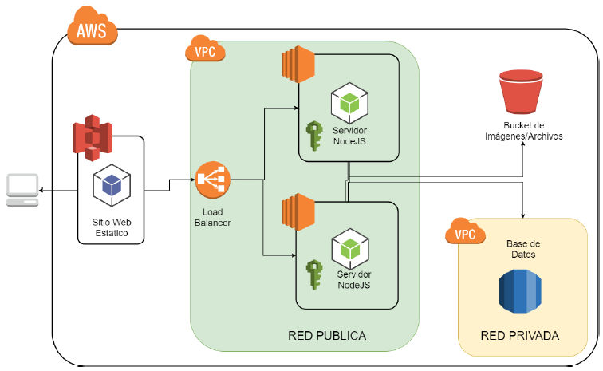

- ### VPC

    Se utilizo una red VPC para toda la arquitectura de la aplicacion:

    - Subred publica: Se utilizo unicamente para los 2 servidores y para el loadbalancer.
    - Subred privada: Se utilizo para la base de datos.

- ### S3

    Se utilizo un bucket de S3 para almacenar la pagina web y se utilizo otro para almacenar los archivos.

- ### EC2

    - Se utilizaron 2 instancias de EC2 para montar los servidores.
    - Se utilizo NODEJS para los servidores.
    - Se utilizo Ubuntu como sistema operativo.

- ### Load Balancer

    - Se utilizo un balanceador de carga para enlazar las instancias EC2.

- ### RDS

    - Se utilizo una instancia de RDS para la base de datos.
    - Se utilizo MYSQL como motor de base de datos.

- ### IAM 

    - Se utilizaron distintos usuarios IAM para cada servicio por cuestion de seguridad.

## Usuarios IAM utilizados

Por motivos de seguridad se utilizaron 2 usuarios IAM para la elaboracion del proyecto:

- ParaEC2: 

    Se utilizo este usuario para administrar los siguientes servicios: EC2, Load balancer, RDS y VPC. Los servicios se agruparon de esa manera porque tanto las EC2 como el Load Balancer y la RDS, estaran dentro de la red de la VPC. Se le asignaron las siguientes politicas:

    - AmazonRDSFullAccess: Esta politica permite que el usuario obtenga acceso completo a todos los recursos y caracteristicas de Amazon RDS.

    - AmazonEC2FullAccess: Esta politica permite que el usuario obtenga acceso completo a todos los recursos y caracteristicas de Amazon EC2.

    - ElasticLoadBalancingFullAccess: Esta politica permite que el usuario obtenga acceso completo a todos los recursos y caracteristicas de Elastic Load Balancing.

    - AmazonVPCFullAccess: Esta politica permite que el usuario obtenga acceso completo a todos los recursos y caracteristicas de Amazon VPC.

    

  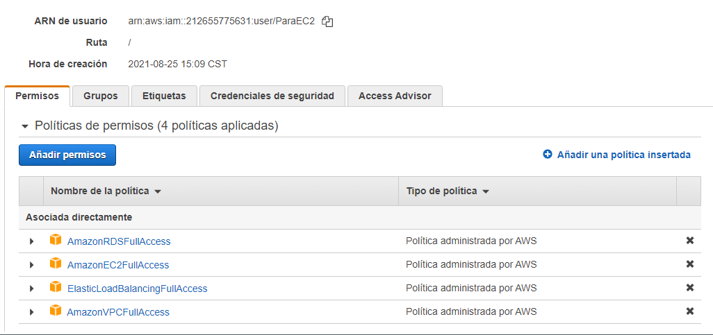
    

- Admin_S3:

    Se utilizo este usuario para administrar el servicio de S3, no se incluyo este servicio en el usuario ParaEC2, porque este servicio no depende de otros servicios para el funcionamiento de la pagina web. Se le asignaron las siguientes politicas:

    - AmazonS3FullAccess: Esta politica permite que el usuario obtenga acceso completo a todos los recursos y caracteristicas de Amazon S3.

## Configuracion de cada servicio

### Configuracion de VPC

1. Primero utilizamos la opcion crear VPC y le asignamos un nombre y el rango de direcciones IPV4.

 

  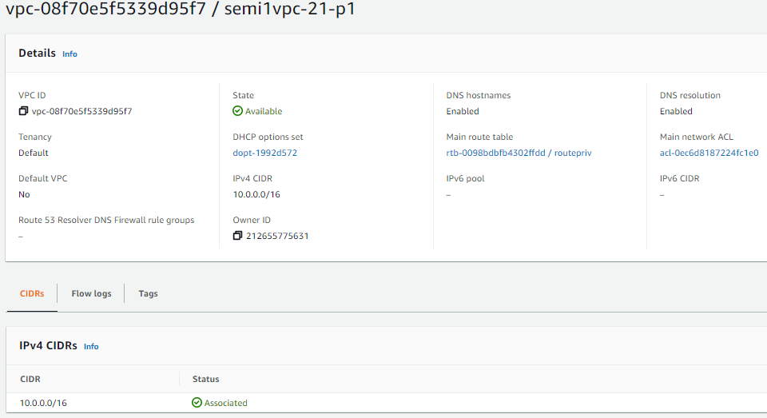
    

2. Despues creamos 3 subnets, 2 publicas y una privada:
    - Para crear una subnet, seleccionamos la vpc que creamos anteriormente, le asignamos una availability zone y un rango de direcciones.

        

        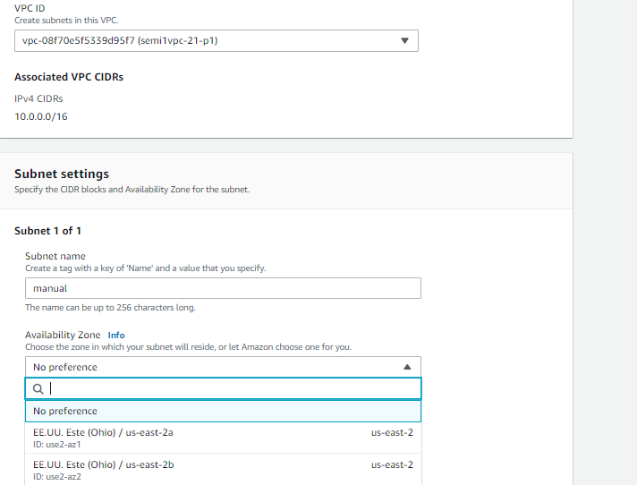
        

    - Repetimos el mismo proceso para cada subnet asignando un availability zone diferente para cada una.

        

        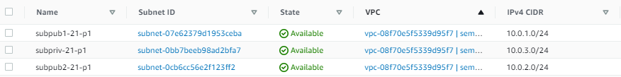
        

3. Despues creamos 2 route tables, una para las subnet publicas y la otra para la privada:

    -   Creamos la route table seleccionando la vpc que creamos y le ponemos un nombre:

         

        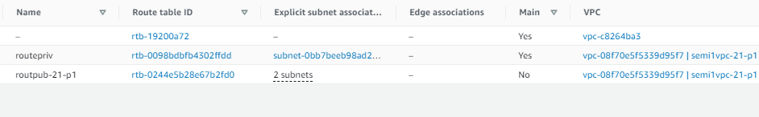
        

    -   Luego asociamos las subnets que les corresponden.

        

        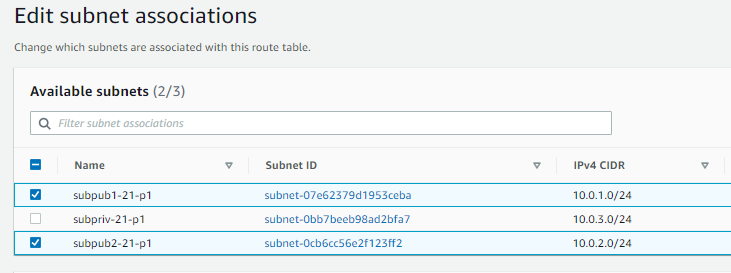
        

4. Despues creamos la internet gateway:

    - Creamos la IG asociandola a la vpc.

        

        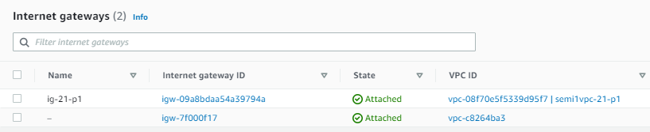
        

    
    - Despues asociamos la IG a las route tables:

        

        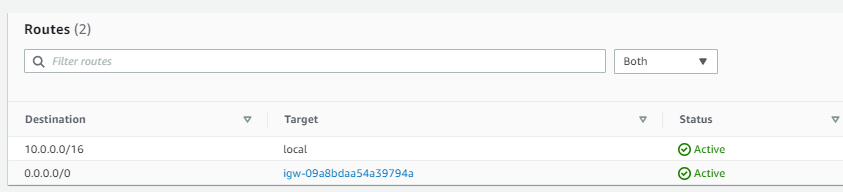
        

## Configuracion EC2 y Load Balancer

1. Primero usamos la opcion lanzar instancia, seleccionamos ubuntu 20.04 como OS y seleccionamos las configuraciones que se encuentren bajo la capa gratuita.

2. Despues asociamos la vpc a las EC2, le asignamos la subnet publica y le asignamos un security groups con los puertos necesiarios habilitados.

    

    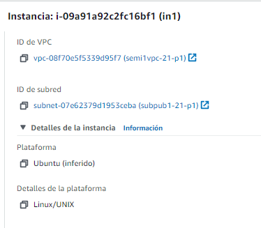
    

3. Repetimos el mismo proceso para ambas EC2

    

    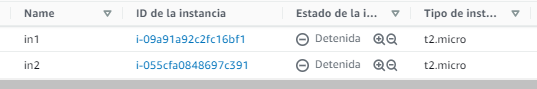
    

4. Luego, usamos la opcion crear balanceador de carga en la seccion balanceadores de carga.

    - Usamos la opcion balanceador de carga clasico, utilizamos la vpc que creamos y asociamos ambas instancias EC2.

    

    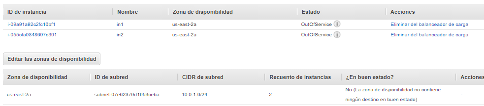
    

    -  Luego modificamos los puertos.

    

    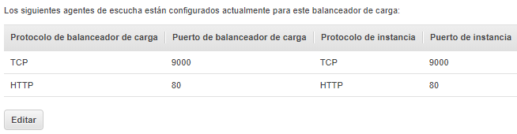
    

## Configuracion RDS

1. Primero se selecciono la opcion crear base de datos, se selecciono el metodo de creacion estandar, se selecciono mysql como motor y se utilizo la capa gratuita para la instancia.

    

    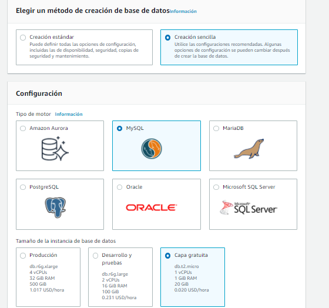
    

2. Se le asigna un nombre a la instancia, tambien se le asigna un nombre al usuario administrador y una contraseña.

3. Se le asigna la vpc, el acceso publico se configura como privado y se le asigna un grupo de seguridad con los puertos habilitados.

  

    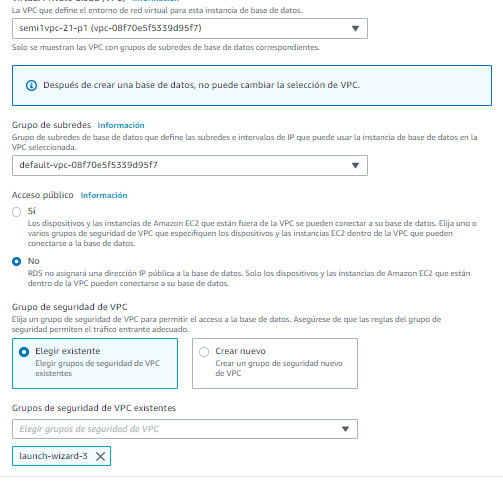
    

## Conclusiones

-   Los grupos de seguridad fueron parte importante en la mayoria de servicios, si los grupo de seguridad no se configuran correctamente aun asi los servicios estan configurados correctamente no podremos utilizarlos.

-  Es mas facil utilizar solo un usuario IAM para utilizar todos los servicios, pero tambien es mas inseguro, porque si la seguridad del usuario se compromete entonces todos los servicios configurados estarian en riesgo y por ende el proyecto.

    

