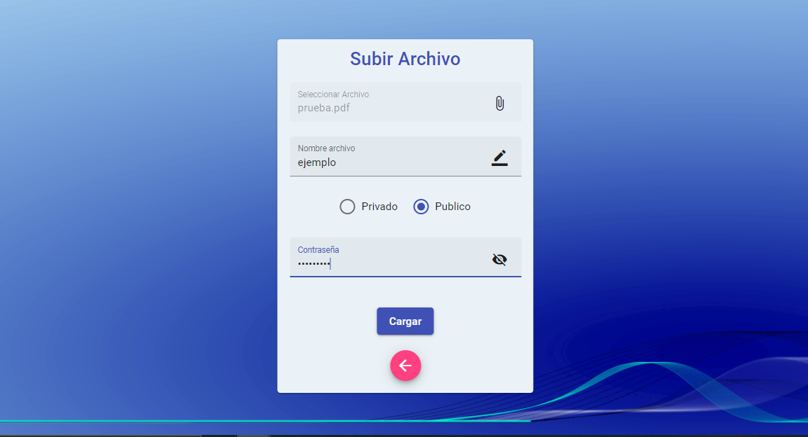

# Manual de Usuario

## Objetivos

### General

- Facilitar el uso y el aprendizaje del funcionamiento de la pagina web.

### Especifico

- Explicar como crear una cuenta e iniciar sesion. 

- Explicar como subir y editar archivos.

- Explicar como buscar y agregar amigos.

- Explicar como visualizar archivos publicos.

## Explicacion de la aplicacion

Pagina Web creada para el almacenamiento de archivos publicos y privados con opcion de agregar amigos y poder ver sus archivos compartidos.

### Login y Registro de usuario

Al entrar a la pagina web se mostrara una ventana para iniciar sesion, si el usuario ya tiene una cuenta, entonces podra ingresar.

  

Si el usuario no tiene una cuenta entonces debe seleccionar la opcion crear cuenta, se mostrara una ventana que indicara los datos que debe ingresar para poder registrarse.

  

### Home

Al momento iniciar sesion la pagina web mostrara el "home", en esta ventana se podra ver la foto de perfil del usuario, sus archivos publicos y privados, el boton agregar amigos y los botones para manipular los archivos.

  

### Subir, editar y eliminar archivos

Para subir una archivo hay que seleccionar el boton subir archivo que se encuentra en el home, entonces se abrira una ventana donde seleccionaremos nuestro archivo y le pondremos un nombre, los archivos pueden ser privados o publicos, la diferencia es que los archivos publicos pueden ser vistos por los amigos del usuario. Tambien por motivos de seguridad, se debera ingresar la contraseña para poder subir el archivo.

  

Despues de subir el archivo, este se podra visualizar en el home.

  

Para editar un archivo hay que seleccionar el boton editar archivo que se encuentra en el home, se abrira una ventana donde seleccionaremos el archivo a editar, cabe aclarar que solo se podra editar el nombre y el tipo de archivo (publico o privado), tambien se debera ingresar la contraseña para confirmar los cambios.

  

Despues de editar el archivo, el cambio se podra visualizar en el home.

  

Para eliminar un archivo hay que seleccionar el boton eliminar archivo que se encuentra en el home, se abrira una ventana donde seleccionaremos el archivo a eliminar, tambien se debera ingresar la contraseña para confirmar los cambios.

  

Despues de eliminar el archivo, el cambio se podra visualizar en el home.

  

### Buscar y agregar amigos

Para agregar amigos hay que seleccionar el boton seleccionar amigo que se encuentra en el home, se abrira una ventana donde apareceran usuarios con archivos publicos.. 

  

Tambien habra un buscador donde se podra buscar usuarios por su nombre y para agregar amigo solo debe presionar el boton seguir.

  

### Ver archivos publicos de amigos

Para poder ver los archivos publicos de los amigos agregados, entonces debe presionar el boton archivos publicos y podra ver los archivos publicos de los amigos.

  

